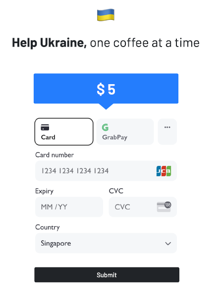

## Learning Loop

Sprint by @wongsn and @fcyen

[Stripe Docs](https://stripe.com/docs/checkout/quickstart?client=next)

Hosted on Heroku

[Gimme Kopi!](gimme-kopi.herokuapp.com/)

### Challenge Prompt

How would you build a Stripe checkout with as little code as possible?

The best code is the simplest code optimized for minimal complexity for maintenance and debugging. The goal of this project is to discover together how to best go about tackling that. In addition to it working, it should also involve the least amount of complexity to the system.

## Running the sample

1. Fork and clone the repo

```
mkdir stripe_practice & cd stripe_practice
git clone https://github.com/wongsn/learningloop_stripe.git
```

2. Build the application

```
npm install
```

3. Get your publishable keys and API secrets from [Stripe]('https://dashboard.stripe.com/apikeys') and put it into

```
.env
```

4. Run the application on two separate terminal tabs (for server and client)

```
npm run start
npm run start-client
```

5. Go to [http://localhost:3000/checkout](http://localhost:3000/checkout)

## Ideation

We came about with the concept of a one-stop payment portal after being inspired by the recent Russian-Ukraine conflict. People were looking to donate to a common cause (albeit anonymously) but often find it very cumbersome to write checks or clear very lengthy payment channels. Since Stripe is E2E-secured, we thought that:

- Fixing the price of payment (at the cost of a typical cuppa, at $5)
- Fixing the mode of payment (c'mon, everyone has a credit/debit card)
  would help to reduce programmatic complexity

## Design



_wireframes by @fcyen_

## Tech Implementation

Front: React

Back: Express, Stripe

## Reflections

@fcyen: "In this challenge I've discovered Stripe’s API and the different ways it offers developers to implement a payment flow. It's also a chance to brush up on my CSS skills and learn how to deploy a heroku app with both client and server code.

I also learned that the planning phase prior to coding is important. Firstly, asking clarifying questions helps you to better understand the problem statement and secondly, brainstorming with your partner generates interesting ideas and allows transfer of knowledge. With these, we were able to come up with a ‘game plan’ that we feel most satisfied with.

It’s been an awesome experience participating in this week-long program and partnering up with @wongsn!"

@wongsn: "I've come to appreciate how such a simple task can trip so many people up if the understanding of the technology is not sound. When we started, we erroneously called the clientsecret via the API routes in a NextJS app. We also tried and failed many ways to deploy a React app onto Heroku while serving the server in the same port.

It's a great experience working with @fcyen as we have complementary skills to bring to the table, and she's really patient in debugging the problems with me!
"
